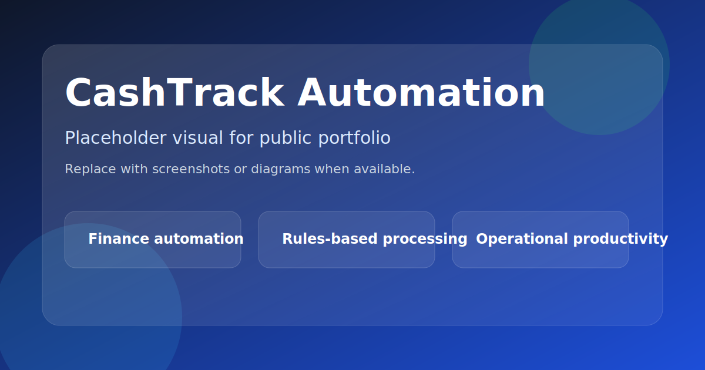
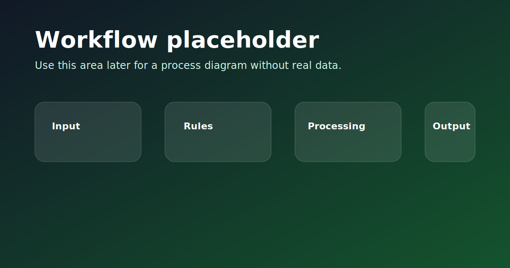

# CashTrack Automation




Automação financeira em Python para reduzir retrabalho, padronizar conciliações e acelerar rotinas operacionais com rastreabilidade.

---

## Visão geral

O CashTrack Automation foi criado para automatizar etapas repetitivas da rotina financeira, principalmente importação de extratos OFX, organização de lançamentos e apoio à classificação operacional.

O foco é simples: transformar tarefas manuais em um fluxo seguro, repetível e fácil de auditar.

---

## Problema de negócio

Rotinas financeiras manuais costumam gerar:

- retrabalho em lançamentos e conferências;
- padronização inconsistente;
- mais risco de erro humano;
- perda de tempo em tarefas operacionais;
- dificuldade para escalar a operação.

---

## Solução desenvolvida

O projeto automatiza a leitura e o tratamento dos dados financeiros, aplicando regras de negócio para reduzir intervenção manual e melhorar a qualidade do processo.

---

## Funcionalidades principais

- Importação automática de arquivos OFX
- Classificação de transações por regras
- Tratamento de descrições bancárias
- Preenchimento automático de campos operacionais
- Regras centralizadas em arquivos de configuração
- Apoio à conciliação e à padronização de lançamentos
- Estrutura pensada para evolução com automação web e etapas assistidas

---

## Tecnologias utilizadas

- Python
- Pandas
- YAML
- Selenium
- Playwright
- Automação Web
- ETL

---

## Impacto estimado

- Menos trabalho manual em tarefas repetitivas
- Mais velocidade na rotina financeira
- Menor risco de erro operacional
- Melhor padronização dos lançamentos
- Base mais confiável para análise e conciliação

---

## Demonstrações visuais



Os visuais nesta pasta são placeholders e não expõem dados reais.

---

## Segurança e privacidade

- Sem exposição de dados sensíveis
- Sem envio de credenciais no repositório
- Sem uso de planilhas reais no material público
- Estrutura pensada para demonstrar o fluxo sem comprometer informação interna

---

## Próximos passos

- Evoluir a cobertura de regras de classificação
- Ampliar a observabilidade do processo
- Integrar novas fontes e camadas de auditoria
- Refinar a experiência de execução para equipes operacionais

---

## Como executar

```bash
git clone https://github.com/FxNunesDev/CashTrack-Automation.git
cd CashTrack-Automation
pip install -r requirements.txt
python selenium_cashtrack_v5.py
```

---

## Estrutura do projeto

```text
/rpa
/regras
/ofx
/logs
/docs
/assets
```